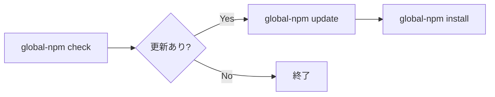

# 📦 Global npm Package Setup

Node.js の **グローバル npm パッケージ管理** を `package.json` で一元化する CLI です。
macOS / Windows 11で同じ `global-npm` フローを使えます。

GitHub: [stein2nd/global-npm-setup](https://github.com/stein2nd/global-npm-setup)

## コマンド

```
global-npm check    # グローバルパッケージの更新確認 (ncu)
global-npm update   # package.json のバージョン範囲を更新 (ncu -u)
global-npm install  # dependencies を列挙して npm install -g を実行
global-npm sync     # upstream + user-deps → 実効 package.json を再生成
global-npm add      # user-deps.json にパッケージを追記
```

定番フローは、下記の順番になるかと思います。なお、`install` 単体では ncu は実行しません。

```sh
global-npm check
global-npm update
global-npm install
```

## しくみ (v2.1)

| レイヤ | 場所 | 役割 |
|--------|------|------|
| Upstream 正本 | `@s2j/global-npm` 同梱 `package.json` | 公式 `dependencies` 一覧 |
| ユーザー overlay | `$SETUP_DIR/user-deps.json` | 追加分、ピン留め |
| 実効 package.json | `$SETUP_DIR/package.json` | ncu / install が読む実効マニフェスト |

**setup ディレクトリ (`$SETUP_DIR`) のデフォルト**

| OS | パス |
|----|------|
| macOS / Linux | `~/.config/global-npm` |
| Windows 11 | `%APPDATA%\global-npm` |

`GLOBAL_NPM_SETUP_DIR` 環境変数で上書きできます。詳細は [docs/layout.md](./docs/layout.md) をご覧ください。

## セットアップ

`@s2j/global-npm` は npm パッケージとして利用することを推奨します。

### macOS での下準備

Homebrew、Node.js v18以降が未導入の場合は、先にインストールしてください。

1. `node -v` を実行する。
   1. 失敗する場合は、`brew install node` または `nvm install` などで、Node.js をインストールする。
2. `node --version`、`npm --version` でバージョンを確認する。
3. 移行する場合、`~/bin/global-npm` (Zsh ラッパー) が PATH に残っていないか確認する。残っている場合は削除する (npm グローバル bin の `global-npm` と競合する場合がある)。

* 推奨配置 (開発): `~/dotfiles/global-npm-setup/`  
* setup ディレクトリ: `~/.config/global-npm`  
* npm グローバル bin: 通常 `$(npm prefix -g)/bin` (nvm 利用時はその Node に紐づく prefix)

### Windows での下準備

Node.js v18以上 (LTS 推奨) が未導入の場合は、先にインストールしてください。[fnm](https://github.com/Schniz/fnm)、[nvm-windows](https://github.com/coreybutler/nvm-windows)、[Volta](https://volta.sh/)、公式インストーラのいずれでもかまいません。

1. `node -v` を実行する。
   1. 失敗する場合は、[Node.js 公式サイト](https://nodejs.org/ja) などから Node.js をインストールする。
   2. PowerShell で `where.exe node`、`where.exe npm` を実行して、Node.js が正常にインストールされているか確認する。
2. PowerShell でスクリプトの実行権限を `Get-ExecutionPolicy` (勤務先 PC の場合は `Get-ExecutionPolicy -List`) で確認する。
   1. `Restricted` の場合は、`Set-ExecutionPolicy -Scope CurrentUser RemoteSigned` を実行する。
   2. あらためて `Get-ExecutionPolicy` で `RemoteSigned` になっているか確認する。
3. `node --version`、`npm --version` でバージョンを確認する。
4. PowerShell を再起動後、`global-npm check` (導入後) で PATH を確認する。

* 推奨配置 (開発): `%USERPROFILE%\dotfiles\global-npm-setup\`  
* setup ディレクトリ: `%APPDATA%\global-npm`  
* npm グローバル bin: `%AppData%\npm` (通常 PATH に含まれる)

### npm パッケージの導入

```sh
npm install -g @s2j/global-npm   # CLI 本体の導入 (これは一度だけ)
global-npm add @s2j/docs-linter@^1.0.16   # 任意: ユーザー追加分
global-npm install               # 実効 package.json の dependencies を global install
```

初回の `global-npm install` で `~/.config/global-npm/` (Windows 11では `%APPDATA%\global-npm\`) に実効 `package.json` が生成されます。
`global-npm install` は、`@s2j/global-npm` 自身 (自己参照) も含め、`dependencies` のキーを列挙して `npm install -g` します。

### 開発: リポジトリ clone

```sh
git clone https://github.com/stein2nd/global-npm-setup.git
cd global-npm-setup
npm link
GLOBAL_NPM_SETUP_DIR=.sandbox/setup global-npm sync
global-npm install
```

## ユーザー追加分の管理

```sh
# 追加分を登録 (range 省略時は npm view で ^x.y.z、失敗時は *)
global-npm add typescript
global-npm add eslint --dev

# マージ結果を確認 (書き込みなし)
global-npm sync --dry-run
```

* upstream (`npm update -g @s2j/global-npm`) 更新後も、ユーザー追加分は消えない。
* upstream 管理パッケージのうち未 update 分は、次回 `check` 時の sync で新 range に追従する。
* upstream パッケージをピン留めする場合は、`user-deps.json` の `dependencies` に同名で range を書く。

## 使い方

下記については、[使い方](./docs/usage.md) をご覧ください。

* 各コマンドの役割
* 定番フロー (`check` → `update` → `install`)
* 毎回 `sync` を実行する必要があるか
* upstream 管理分と追加分の衝突が起こった場合 

## 日常の更新サイクル



* **check:** sync 後に ncu で更新候補を表示。ncu 自体は range を書き換えない。
* **update:** 実効 package.json の `dependencies` / `devDependencies` の range を更新。
* **install:** 実効 package.json の **dependencies** のみ global install。

## 開発用 scripts

CLI 実装のデバッグ用に、リポジトリ root から下記の npm scripts も使えます。

```sh
npm run ncu:check
npm run ncu:update
```

## 移行

### v1→ v2

| v1 | v2 |
|----|-----|
| `~/bin/global-npm` (Zsh) | 廃止: `npm install -g @s2j/global-npm` |
| `install-global.zsh` | 廃止: `global-npm install` |
| `ncu:install` (jq 列挙) | `global-npm install` (Node 列挙) |

### v2.0.x → v2.1

| v2.0.x | v2.1 |
|--------|------|
| setup = package root | setup = `~/.config/global-npm`。Windows は `%APPDATA%\global-npm` |
| 同梱 `package.json` を直接 ncu | 実効 package.json を ncu |
| 3サブコマンド | 5サブコマンド (`sync` / `add` 追加) |

移行手順は、下記のとおりです。

1. `npm update -g @s2j/global-npm` で v2.1に上げる。
2. 追加分を `global-npm add …` で登録する。
3. `global-npm sync` で 実効 package.json を生成する。
4. `global-npm install` で global 環境を同期する。

## ライセンス

GPL-3.0-or-later: 詳細は [LICENSE](./LICENSE) をご覧ください。
