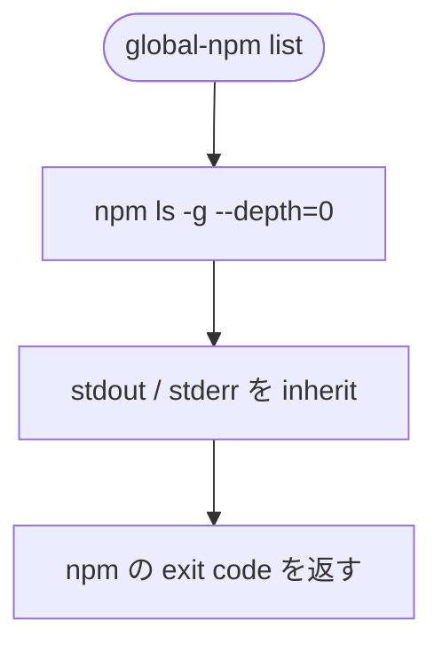

# Global npm Package Setup - CLI list サブコマンド

`global-npm list` サブコマンドの詳細仕様です。要点は [cli.md](./cli.md) に反映済みです。

関連: [archive/mod-cli-list/modification.md](./archive/mod-cli-list/modification.md)

## 背景

v2.1までの CLI は、実効 `package.json` を起点に **更新確認、range 更新、global install** を行うコマンドが中心でした。
一方、ユーザーが「いま global に何が入っているか」を確認するには、毎回 `npm ls -g --depth=0` を直接実行する必要があります。

`global-npm list` は、この確認を CLI から提供します。
manifest の内容ではなく、**実際に global インストールされている、トップレベルパッケージ** を表示します。

## 決定事項サマリー

| 項目 | 決定 |
|------|------|
| サブコマンド名 | `list` |
| 実装 | `npm ls -g --depth=0` を透過実行 (`stdio: 'inherit'`) |
| 事前 `syncManifest()` | **呼ばない** (読み取り専用) |
| 出力 | npm の標準出力を **そのまま** 表示する (加工やフィルターなし) |
| prefix 行 | **省略しない** (1行目の global prefix パスを npm 出力どおり残す) |
| 追加引数 | v2.2では受け付けない (未知引数は usage → `exit 1`) |
| 定番フロー | **含めない** (`check` → `update` → `install` とは独立) |
| バージョン | v2.2.0 (非破壊的な機能追加) |

## 目的と非目的

### 目的

* 現在の Node.js / npm 環境における **global インストール先 (prefix)** を示す。
* トップレベルの global パッケージ一覧を、npm と同じ形式で確認できる。
* macOS (nvm 等)、Windows 11で同一のサブコマンド名を提供する。

### 非目的 (v2.2では行わない)

* 実効 `package.json` との差分表示。
* manifest 管理対象のみに絞った一覧。
* npm 出力の再フォーマット (ツリー記号や prefix 行の加工)。
* `npm ls` の `--depth` 等オプションの透過。

## `$SETUP_DIR` との関係

| 概念 | パス例 | `list` で示すか |
|------|--------|-----------------|
| 実効 manifest | `$SETUP_DIR/package.json` | 否 (manifest は表示しない) |
| global prefix | `npm prefix -g` 配下 (例: nvm 利用時 `~/.nvm/versions/node/v26.3.0/lib`) | **是** (npm 出力1行目) |

`list` は **「global ってどこ ?」** を npm に委ねて表示します。
`GLOBAL_NPM_SETUP_DIR` の値そのものは出力しません (必要なら別途 `echo $GLOBAL_NPM_SETUP_DIR` 等)。

## コマンド仕様

### `global-npm list`

| 項目 | 内容 |
|------|------|
| 目的 | 現在の global 環境にインストールされているトップレベルパッケージを一覧する。 |
| 事前処理 | なし (`syncManifest()` を呼ばない) |
| 実装 | `spawnSync('npm', ['ls', '-g', '--depth=0'], { stdio: 'inherit', shell: win32 })` |
| 副作用 | なし (ファイル読み書きなし) |
| exit code | 子プロセス (`npm`) の status をそのまま返す |

### 出力例 (macOS + nvm)

```
/Users/ユーザー名/.nvm/versions/node/v26.3.0/lib
├── @s2j/docs-linter@1.0.18
├── @s2j/global-npm@2.1.3
├── corepack@0.35.0
…
└── wpapi@1.2.2
```

1行目の prefix パスは **省略しません**。nvm、fnm、Volta 等で Node.js を切り替えた際の切り分けに必要なためです。

### usage への追記

```
Usage: global-npm <check|update|install|sync|add|list>

  check    Check for available updates (ncu -g)
  update   Update version ranges in package.json (ncu -g -u)
  install  Install dependencies globally (npm install -g <name>@<range>…)
  sync     Merge upstream + user-deps into materialized package.json
  add      Add a package to user-deps.json (optional: --dev)
  list     List top-level globally installed packages (npm ls -g --depth=0)
```

## 実行フロー



`check`、`update`、`install` と異なり、`resolveSetupContext` 以降の manifest 操作は行いません。

## 実装メモ

| ファイル | 変更 |
|----------|------|
| `bin/global-npm.cjs` | `case 'list':` を追加。`usage()` に `list` を追記 |
| `docs/cli.md` | サブコマンド仕様を追記 (確定後) |
| `docs/usage.md` | トラブルシュートや確認用途として1行追記 (任意) |
| `README.md` | コマンド一覧に `list` を追記 |
| `test/spec-compliance.test.cjs` | 仕様準拠マークを追加 |

新規 `lib/` モジュールは、不要です。

## 仕様準拠テスト (案)

| ID | 条件 |
|----|------|
| CLI-20 | `list` サブコマンドが `npm ls -g --depth=0` を spawn すること。 |
| CLI-21 | `list` の実装が `syncManifest` / `prepare` を呼ばないこと (ソース静的確認)。 |
| CLI-22 | `usage` 文字列に `list` が含まれること。 |

## 実機確認 (任意)

| OS | 確認項目 |
|----|----------|
| macOS | prefix 行が表示される。一覧が `npm ls -g --depth=0` と一致する。 |
| Windows 11 | 同上 (PowerShell)。 |

## ステータス

**確定 (v2.2):** [cli.md](./cli.md) に反映済み。進行記録は [archive/mod-cli-list/](./archive/mod-cli-list/modification.md)。
