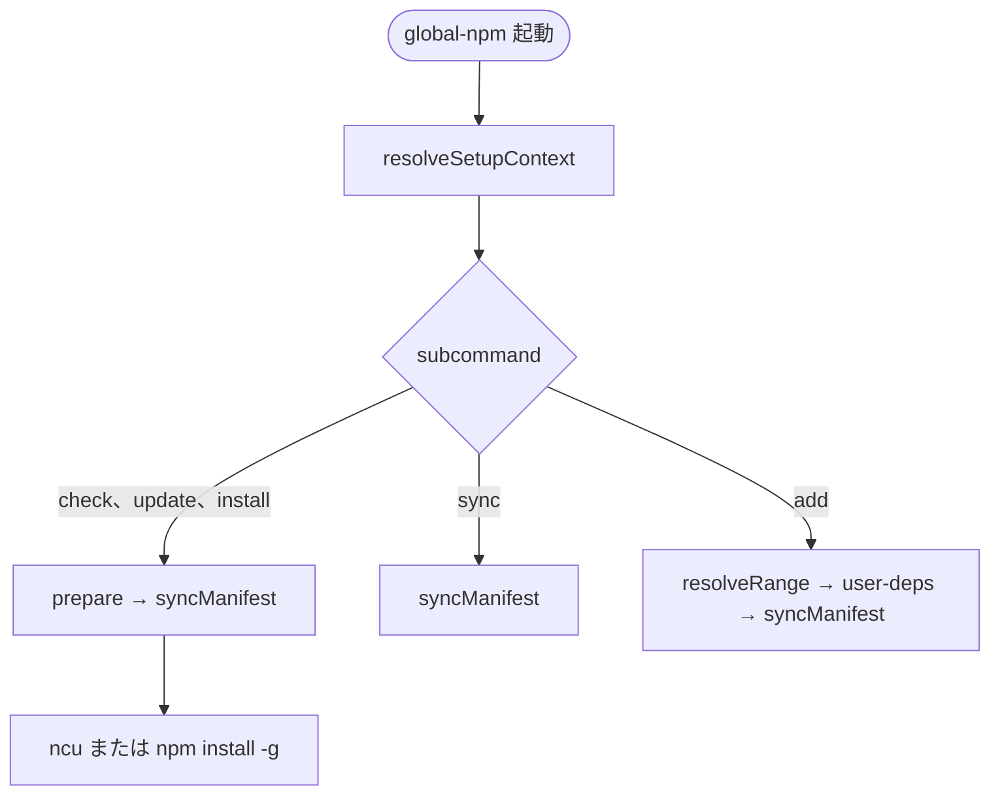

# Global npm Package Setup - CLI (脱 OS 依存改修)

## 背景

v1では `~/bin/global-npm` (Zsh) が `npm run ncu:*` を呼び出していました。
v2では Node.js 製 CLI として `@s2j/global-npm` に同梱し、macOS、Windows 11で同一のサブコマンドを提供します。

v2.1以降は **overlay manifest** を採用します。
`check`、`update`、`install` は実効 `package.json` を操作します ([layout.md](./layout.md))。

install の実装は **C 型 (Node 列挙 → 明示 `npm install -g`)** とします。詳細は [install.md](./install.md) をご覧ください。

## コマンド一覧

```
global-npm check    # グローバルパッケージの更新確認 (ncu)
global-npm update   # package.json のバージョン範囲を更新 (ncu -u)
global-npm install  # dependencies を列挙して npm install -g を実行
global-npm sync     # upstream + user-deps → 実効 package.json を再生成
global-npm add      # user-deps.json にパッケージを追記
```

## 各サブコマンドの仕様

### 共通: 事前 sync

`check`、`update`、`install` は実行前に `syncManifest()` を呼び、`$SETUP_DIR/package.json` (実効 package.json) を最新化します。

### `global-npm check`

| 項目 | 内容 |
|------|------|
| 目的 | 管理対象パッケージに利用可能な更新があるか確認する。 |
| 事前処理 | `syncManifest()` |
| 実装 | 同梱 `npm-check-updates` を優先起動し、`-g --format time --packageFile <materialized>/package.json` |
| 副作用 | 実効 package.json は sync により更新されうる。ncu 自体は check 時に range を書き換えない。 |
| v1相当 | `npm run ncu:check` |

`--format time` により各パッケージの公開日時を表示します。
実効 package.json の `dependencies` と `devDependencies` の両方を ncu が読みます。

### `global-npm update`

| 項目 | 内容 |
|------|------|
| 目的 | 実効 package.json のバージョン範囲を、最新に書き換える。 |
| 事前処理 | `syncManifest()` |
| 実装 | 同梱 `npm-check-updates` を優先起動し、`-g --format time -u --packageFile <materialized>/package.json` |
| 副作用 | 実効 package.json を更新する。`user-deps.json` と upstream 正本は変更しない。 |
| v1相当 | `npm run ncu:update` |

### `global-npm install`

| 項目 | 内容 |
|------|------|
| 目的 | 実効 package.json の `dependencies` を **各々トップレベルの global pkg** としてインストールする。 |
| 事前処理 | `syncManifest()` |
| 実装 | C 型: 実効 package.json の `dependencies` を読み、range を `npm view` で具体 version に解決して `npm install -g <name>@<version>…` |
| 副作用 | グローバル node_modules、`{prefix}/bin` を更新。 |
| v1相当 | `ncu:install` の install 部分 |

`devDependencies` は install 対象外です ([install.md](./install.md))。

#### 定番フロー

```sh
global-npm check
global-npm update
global-npm install
```

### `global-npm sync`

| 項目 | 内容 |
|------|------|
| 目的 | upstream + `user-deps.json` → 実効 package.json を再生成する。 |
| 実装 | `syncManifest()` |
| 副作用 | `$SETUP_DIR/package.json` と `.upstream-meta.json` を更新。 |
| オプション | `--dry-run`: ファイル書き込みなし。差分を stderr に表示。 |

ncu、npm は呼びません。

### `global-npm add <pkg>[@range] [--dev]`

| 項目 | 内容 |
|------|------|
| 目的 | `user-deps.json` にパッケージを追記し、sync する。 |
| `--dev` | `devDependencies` に追加 (省略時は `dependencies`)。 |
| range 省略 | `npm view <pkg> version` → `^x.y.z`。失敗時は `*` にフォールバック。 |
| 副作用 | `user-deps.json` 更新 → `syncManifest()`。自動 `install` はしない。 |

```sh
global-npm add @s2j/docs-linter@^1.0.16
global-npm add typescript --dev
global-npm add lodash          # npm view で ^x.y.z を自動設定
```

## CLI 実装

| 項目 | 内容 |
|------|------|
| 言語 | Node.js (CommonJS) |
| エントリ | `bin/global-npm.cjs` |
| ライブラリ | `lib/paths.cjs`, `lib/sync-manifest.cjs` 等 |
| shebang | `#!/usr/bin/env node` |
| 引数解析 | サブコマンド5つ。未知の引数は usage 表示して `exit code: 1` |
| 子プロセス | `child_process.spawnSync` で同梱 ncu (`lib/resolve-ncu.cjs`)、`npm` を呼び出す。 |
| JSON 処理 | `fs` + `JSON.parse` (**jq 不要**) |

### usage

```
Usage: global-npm <check|update|install|sync|add>

  check    Check for available updates (ncu -g)
  update   Update version ranges in package.json (ncu -g -u)
  install  Install dependencies globally (npm install -g …)
  sync     Merge upstream + user-deps into materialized package.json
  add      Add a package to user-deps.json (optional: --dev)
```

## setup ディレクトリの解決

| 項目 | 内容 |
|------|------|
| upstream 正本 | `path.resolve(__dirname, '..')/package.json` |
| 実効 package.json | `$SETUP_DIR/package.json` |
| デフォルト `$SETUP_DIR` | `~/.config/global-npm`。Windows 11では `%APPDATA%\global-npm` |
| 上書き | `GLOBAL_NPM_SETUP_DIR` |

```js
const setupDir = path.resolve(
  process.env.GLOBAL_NPM_SETUP_DIR?.trim() || defaultSetupDir(),
);
```

## サブコマンド実行フロー

詳細なシークェンス図は [mod-overlay-manifest.md](../docsMod/mod-overlay-manifest.md#サブコマンド実行フロー) をご覧ください。



## 廃止するもの

| v1 | v2 |
|----|-----|
| `~/bin/global-npm` (Zsh) | 廃止 |
| `install-global.zsh` | 廃止 |
| `ncu:install` 内 `jq` | Node 列挙 (C 型) に置換 |
| package root = setup (v2.0.x) | overlay manifest (v2.1) |

`package.json` の `scripts` (`ncu:check` 等) は開発・デバッグ用として残してもよいが、ユーザー向け入口は CLI に一本化します。

## ステータス

**確定 (v2.1):** `docs/cli.md` に反映済み。
