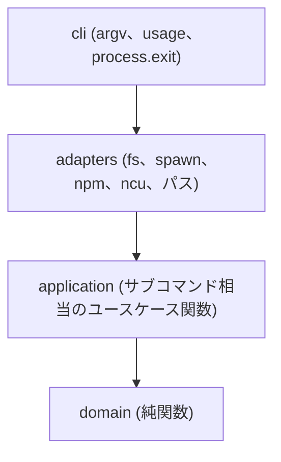

# Global npm Package Setup - SPECS

確定した仕様ドキュメントへの導線です。
以前の版 (v2.2までの書きぶり) は [archive/v2-specs/](./archive/v2-specs/) に freeze しています。

## シリーズ位置付け

本プロジェクトは **Global Package Setup** シリーズの npm 実装です。

| 項目 | 内容 |
| --- | --- |
| シリーズ | Global Package Setup |
| 本プロジェクト | Global npm Package Setup (`global-npm-setup`) |
| npm パッケージ | `@s2j/global-npm` |
| CLUI コマンド | `global-npm` |
| 姉妹プロジェクト | `global-composer-setup` (Composer 向けの同趣旨ツール) |
| アプリケーション類型 | **CLUI ユーティリティ** (対話 TUI や GUI ではない) |

シリーズでそろえるものは、次のとおりです。

* グローバルに入れるパッケージ一覧を、マニフェストで管理する。
* 公式一覧 (upstream) と利用側の追加分 (overlay) を分ける。
* OS を問わず、同じサブコマンド体系で鮮度を管理する。
* 仕様は `docs/` を正本とし、改修中は `docsMod/` で草案を置く。

## 設計方針 (今後の開発)

v2.2までの振る舞い契約 (サブコマンド、overlay マージ、C 型 install) は維持します。
今後の実装・再構成は、次の方針で進めます。

### FOP + Clean Coding

**FOP (関数型オブジェクト指向プログラミング)** を採用します。

* ドメインの判断 (マージ、range の解釈、install spec の組み立て) は **純関数** にする。
* 受け渡すまとまりは、クラス階層ではなく **イミュータブルなプレーンオブジェクト** にする (例: setup コンテキスト)。
* 継承や巨大なサービスオブジェクトは使わない。関数の合成で処理を組む。
* 副作用 (ファイル I/O、子プロセス、stdout / stderr) はアダプタに閉じる。

**Clean Coding** と次の点で両立させます。

* 関数は小さく、名前で意図が読めるようにする。
* 関数は1つにつき1責務。抽象度を混ぜない。
* エラーは黙殺せず、exit code と stderr の契約を守る。
* コメントは「なぜ」を書く。仕様の重複コピーは仕様書側に置く。

### Clean Architecture の部分借用

**フルセットの Clean Architecture は採用しません。**
CLUI ユーティリティに、Entity / UseCase / Controller / Presenter / Gateway のクラス一式と DI コンテナは過剰です。

借用するのは、次の依存の向きだけです。

| 借用する | 採用しない |
| --- | --- |
| ドメインを I/O から独立させる | Entity クラス群 |
| サブコマンドをユースケース関数として明示する | Presenter / Controller の機械的分割 |
| I/O をアダプタに寄せ、テストで差し替えやすくする | リポジトリインターフェースの量産 |
| 依存は内側 (domain) に向かわせる | DI コンテナ、フレームワーク非依存のための過剰なポート |

### ビルドツール: Vite

ソースは TypeScript を基本とし、**Vite** で Node.js 向けにビルドします。

| 項目 | 方針 |
| --- | --- |
| ソース | `src/` (TypeScript) |
| 成果物 | `dist/` (CLUI の実行ファイル) |
| `bin` | ビルド成果を指す |
| 現行 (v2.2) | `bin/*.cjs` + `lib/*.cjs` (CommonJS)。本仕様の配置に再構成する |

プラグインの選定 (shebang 付与、外部依存のバンドル範囲) は実装時に決めます。
ランタイムの前提は Node.js v18以降のままです。

### アプリケーション類型: CLUI

本ツールは **CLUI (Command Line User Interface) ユーティリティ** です。

* 入口はサブコマンドと引数。対話プロンプトや全画面 TUI は持たない。
* 出力は stdout / stderr と exit code。npm や ncu の出力は必要な箇所で `inherit` する。
* ユーザー向けの操作感は、シリーズ内でコマンド名だけが異なる同型を目指す。

## ドキュメント命名規則

* **ファイル名:** ASCII のみ (英数字、ハイフン)。日本語やスペースは使わない。
* **タイトル:** 各ファイルの1行目に `# Global npm Package Setup - …` 形式で記載する。

## 仕様書一覧

| ファイル | 概要 |
| --- | --- |
| [usage.md](./usage.md) | 使い方 (鮮度管理、`check`、`update`、`install`、`add`、`sync`、`list`) |
| [naming.md](./naming.md) | 命名 (シリーズ、`global-npm-setup`、`@s2j/global-npm`、`global-npm`) |
| [cli.md](./cli.md) | CLUI サブコマンドとレイヤ分担 |
| [cli-list.md](./cli-list.md) | `list` サブコマンド (`npm ls -g --depth=0`) の詳細仕様 |
| [install.md](./install.md) | install 方式 C 型 (列挙 → 明示 `npm install -g`) と ncu 整合 |
| [layout.md](./layout.md) | overlay manifest、`$SETUP_DIR`、Vite 前提のリポジトリ構成 |
| [overlay-manifest.md](./overlay-manifest.md) | overlay マージの詳細仕様 (ドメイン純関数) |
| [legacy-scripts.md](./legacy-scripts.md) | v1シェル入口の廃止理由 (CLUI 一本化) |
| [windows.md](./windows.md) | Windows 11向けセットアップ、制約 |
| [license.md](./license.md) | ライセンス MIT → GPL-3.0-or-later |
| [npm-publish.md](./npm-publish.md) | npm 公開 (`@s2j` スコープ、Vite 成果物) |

## 進行管理

| 種別 | 場所 |
| --- | --- |
| 進行中 | [docsMod/modification.md](../docsMod/modification.md)、[status.md](../docsMod/status.md) |
| テスト結果 (自動生成) | [docsMod/test-results.md](../docsMod/test-results.md) — `npm test` |
| 完了した改修 | [archive/](./archive/README.md) |
| 以前の仕様書 | [archive/v2-specs/](./archive/v2-specs/) |

### 仕様書のライフサイクル

1. **草案:** `docsMod/` でリライトする。
2. **確定:** 現行の `docs/*.md` を `docs/archive/` に移動して freeze する。
3. **公開正本:** リライト確定版を `docs/` に移動する。

実装コードの FOP / Vite 再構成は、別 initiative として進めます。
