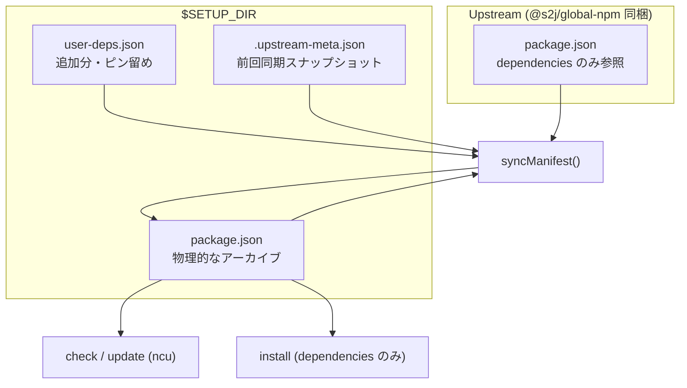
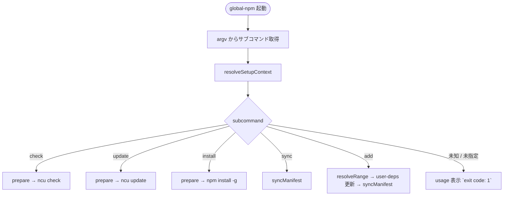
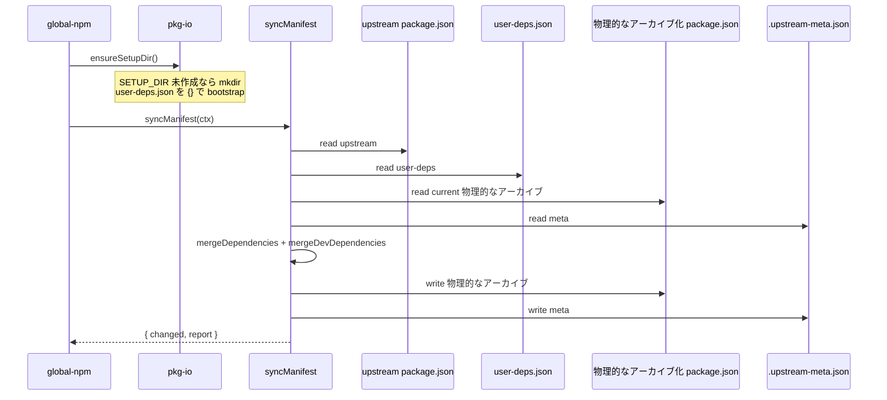
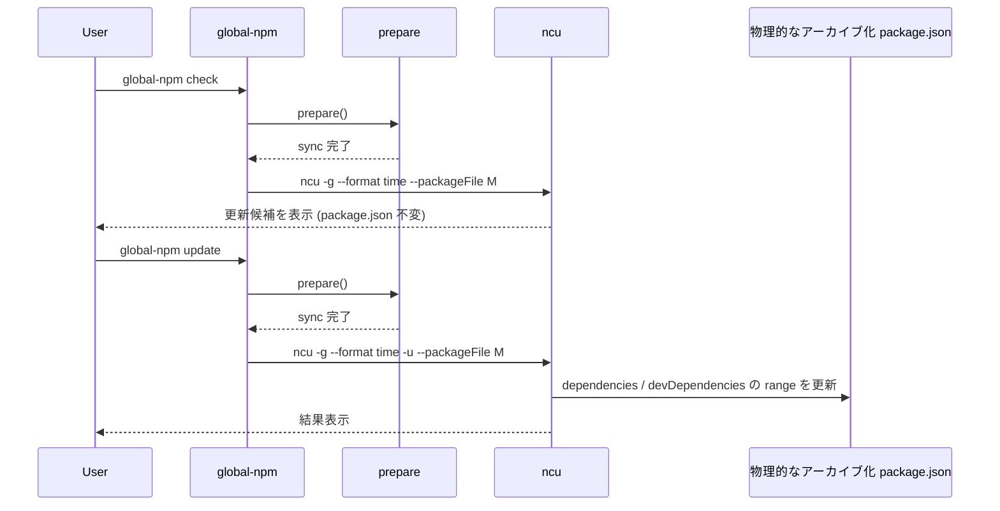
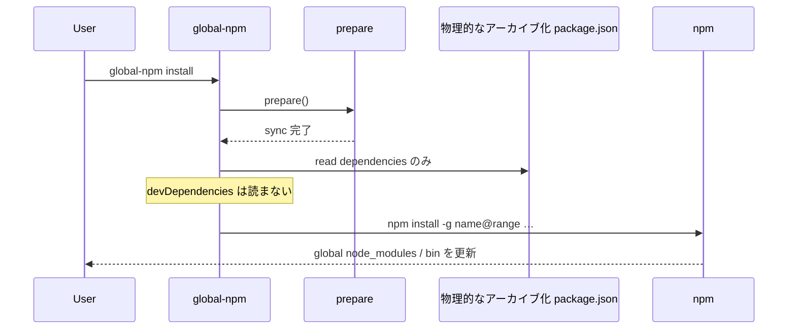
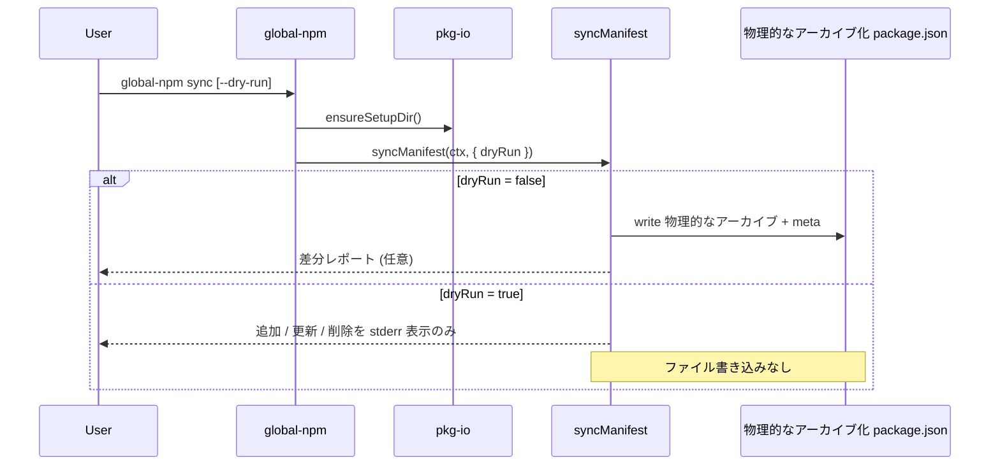
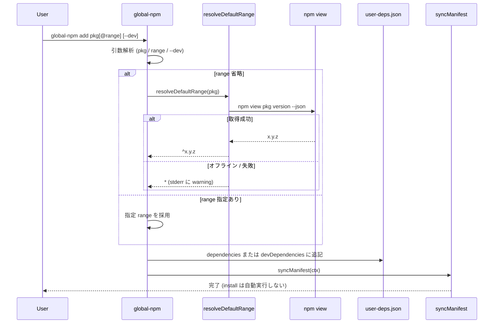
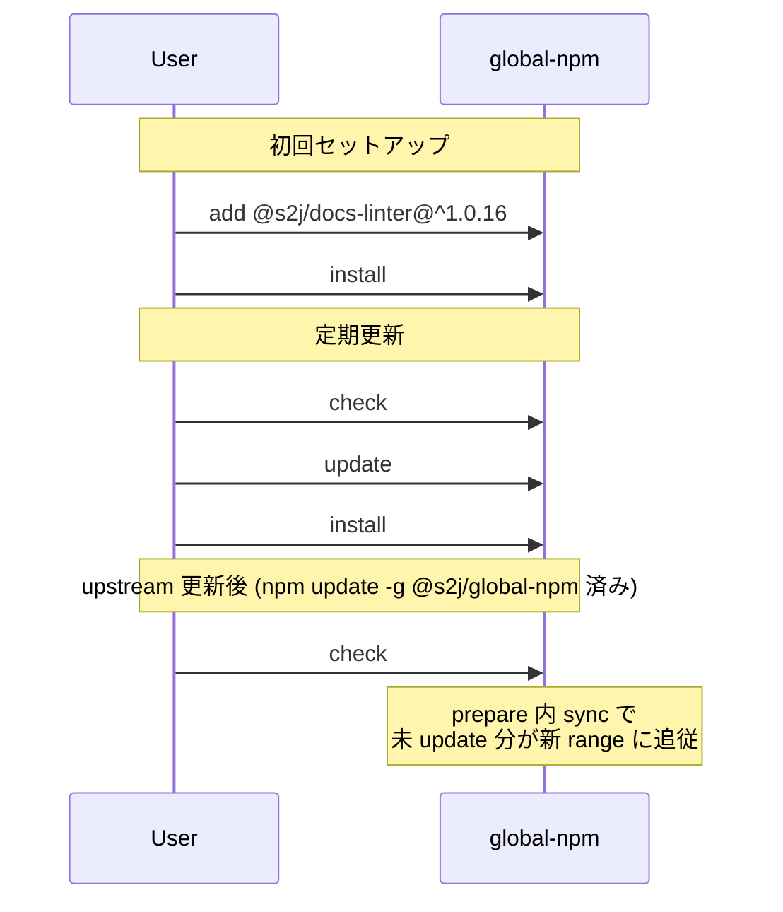

# Global npm Package Setup - Overlay Manifest (方式 B / v2.1)

v2.1で実装する **方式 B (overlay manifest)** の仕様確定稿です。
実装完了後は `docs/layout.md` / `docs/cli.md` / `docs/install.md` に移行します。

関連: [modification.md](./modification.md) タスク #1、[layout.md](../docs/layout.md) (現状は方式 A 確定)

## 背景

v2.0.x は **方式 A (パッケージ同梱) ** のみでした。
`@s2j/global-npm` 同梱の `package.json` が setup ディレクトリ兼 upstream 正本でした。

v2.1では下記を同時に満たします。

* 利用側が希望する npm モジュールを global に追加できる。
* upstream (`@s2j/global-npm`) が `dependencies` を更新しても、利用側の追加分は消えない。
* upstream 更新時、利用側が未 update の upstream 管理パッケージは新 range に追従する。
* 勤務先のみ別 pkg 集合にしたい要件 (方式 B) に対応する。

## 決定事項サマリー

| 項目 | 決定 |
|------|------|
| 方式 | 常に overlay。同梱 `package.json` は upstream 正本のみ |
| setup デフォルト | macOS / Linux: `~/.config/global-npm`、Windows 11: `%APPDATA%\global-npm` |
| 環境変数 | `GLOBAL_NPM_SETUP_DIR` でデフォルトを上書き可能 |
| `devDependencies` | **B 案:** `user-deps.json` の `devDependencies` を物理的なアーカイブにマージ。`install` は `dependencies` のみ |
| upstream `devDependencies` | 物理的なアーカイブに含めない (リポジトリ開発用ツールをユーザー環境に流さない) |
| `user-deps` による range オーバーライト | 可能 (upstream 管理パッケージのピン留め可、最優先) |
| upstream から削除 | ユーザー追加分は維持 / upstream 管理分は物理的なアーカイブから削除 |
| 新サブコマンド | v2.1で `sync` / `add` を追加 |
| `add` の range 省略 | オンライン: `npm view <pkg> version` → `^x.y.z`。オフライン: `*` にフォールバック |
| バージョン | v2.1.0 (v2.0.x からの破壊的変更あり) |

## アーキテクチャー全体像



### レイヤの役割

| レイヤ | パス | 更新者 | 用途 |
|--------|------|--------|------|
| Upstream 正本 | `<packageRoot>/package.json` | npm publish | 公式 `dependencies` 一覧 |
| ユーザー overlay | `$SETUP_DIR/user-deps.json` | ユーザー / `global-npm add` | 追加分、ピン留め |
| 物理的なアーカイブ | `$SETUP_DIR/package.json` | CLI `sync` | ncu / install の実効マニフェスト |
| Meta | `$SETUP_DIR/.upstream-meta.json` | CLI `sync` | 差分検出用スナップショット |

`packageRoot` = `path.resolve(__dirname, '..')` (CLI が属する `@s2j/global-npm` のインストール先)。

## パス解決

### デフォルト `SETUP_DIR`

| OS | デフォルト |
|----|------------|
| macOS / Linux | `~/.config/global-npm` |
| Windows 11 | `%APPDATA%\global-npm` (`process.env.APPDATA`、未設定時は `%USERPROFILE%\AppData\Roaming\global-npm`) |

### 解決式

```js
const setupDir = path.resolve(
  process.env.GLOBAL_NPM_SETUP_DIR?.trim() || defaultSetupDir(),
);
```

`GLOBAL_NPM_SETUP_DIR` 未設定時も overlay が有効です。
v2.0.x の「package root = setup」は廃止します。

## ファイル構成

### `$SETUP_DIR` 一覧

```
~/.config/global-npm/          # または GLOBAL_NPM_SETUP_DIR
├── user-deps.json             # ユーザー追加分、ピン留め
├── package.json               # 物理的なアーカイブ (ncu / install 入力)
└── .upstream-meta.json        # 同期メタ (Git 管理外、ユーザー環境のみ)
```

### `user-deps.json`

```json
{
  "dependencies": {
    "@s2j/docs-linter": "^1.0.16",
    "typescript": "^5.9.3"
  },
  "devDependencies": {
    "some-dev-tool": "^2.0.0"
  }
}
```

* 存在しないキーは `{}` として扱う。
* upstream に存在するパッケージ名でも `dependencies` に書けば、**ピン留め** (最優先)。

### `.upstream-meta.json`

```json
{
  "upstreamVersion": "2.1.0",
  "dependencies": {
    "@s2j/global-npm": "^2.0.2",
    "textlint": "^15.7.1"
  },
  "userDeps": {
    "dependencies": {
      "@s2j/docs-linter": "^1.0.16"
    },
    "devDependencies": {
      "some-dev-tool": "^2.0.0"
    }
  }
}
```

* `dependencies`: 前回同期時の upstream `dependencies` のコピー。
* `userDeps`: 前回同期時の `user-deps.json` のコピー (`devDependencies` の ncu 済み判定に使用)。
* upstream の `devDependencies` は記録しない。

### 物理的なアーカイブ化 `package.json`

```json
{
  "name": "global-npm-user-manifest",
  "private": true,
  "dependencies": {},
  "devDependencies": {}
}
```

`name` / `private` は固定値です。ncu が読める最小構成とします。

## `syncManifest()` — マージ仕様

`check` / `update` / `install` / `sync` / `add` (sync 実行時) の前に呼びます。
初回は `SETUP_DIR` を作成し、空の `user-deps.json` を bootstrap します。

### `dependencies` の優先順位 (高い順)

1. `user-deps.json` の `dependencies` にキーがある → その range (ピン留め)
2. 物理的なアーカイブの値が前回 upstream と異なる → `global-npm update` 済みとみなし維持
3. それ以外 → 新 upstream の range でオーバーライト (未 update 追従)

### `dependencies` マージ手順

**フェーズ1: upstream 管理パッケージ**

```
for (name, upstreamRange) in upstream.dependencies:
  if name in userDeps.dependencies:
    merged[name] = userDeps.dependencies[name]     // ピン留め
  else if current[name] exists AND meta.dependencies[name] exists
          AND current[name] !== meta.dependencies[name]:
    merged[name] = current[name]                     // ncu update 済み
  else:
    merged[name] = upstreamRange                   // 未 update → 追従
```

**フェーズ2: upstream にない user 追加分**

```
for (name, range) in userDeps.dependencies:
  if name not in upstream.dependencies:
    merged[name] = range
```

**フェーズ3: レガシー救済と upstream 削除**

```
for (name, range) in current.dependencies:
  if name in merged: continue

  wasUpstream = name in meta.dependencies
  stillUpstream = name in upstream.dependencies

  if wasUpstream AND NOT stillUpstream AND name not in userDeps.dependencies:
    continue   // upstream 削除 → 物理的なアーカイブからも削除

  merged[name] = range   // ユーザー追加分のみ → 維持
```

### `devDependencies` マージ (B 案)

upstream `devDependencies` は参照しません。`user-deps.json` の `devDependencies` のみが入力源です。

**優先順位**

1. `user-deps.json` の `devDependencies` にキーがある → その range (ピン留め)
2. 物理的なアーカイブが前回 `meta.userDeps.devDependencies` と異なる → ncu update 済みとみなし維持
3. それ以外 → `user-deps` の range を採用

**フェーズ3 (レガシー)**

* `current.devDependencies` にのみ存在し `user-deps` にないキー → 維持 (移行期間の救済)。
* `user-deps` から削除されたキー → 物理的なアーカイブからも削除。

### sync 後の meta 更新

```
meta = {
  upstreamVersion: upstream.version,
  dependencies: { ...upstream.dependencies },
  userDeps: {
    dependencies: { ...userDeps.dependencies },
    devDependencies: { ...userDeps.devDependencies },
  },
}
```

### `--dry-run`

`global-npm sync --dry-run` はファイルを書き込まず、追加 / 更新 / 削除の差分を stderr に表示します。

## CLI サブコマンド (v2.1)

### 一覧

```
global-npm <check|update|install|sync|add>
```

| サブコマンド | 事前 sync | 操作対象 |
|--------------|-----------|----------|
| `check` | あり | 物理的なアーカイブ → `ncu -g --format time --packageFile` |
| `update` | あり | 物理的なアーカイブ → `ncu -g --format time -u --packageFile` |
| `install` | あり | 物理的なアーカイブの **dependencies のみ** → `npm install -g` |
| `sync` | — | upstream + user-deps → 物理的なアーカイブ |
| `add` | 後続 sync | `user-deps.json` に追記 → sync |

`check` / `update` は物理的なアーカイブの `dependencies` と `devDependencies` の両方を ncu が読みます。
`install` は `dependencies` のみとします (`devDependencies` は global install しない)。

### `global-npm add <pkg>[@range] [--dev]`

| 引数 | 内容 |
|------|------|
| `<pkg>` | npm パッケージ名 (スコープ可) |
| `[@range]` | 省略可。semver range またはバージョン |
| `--dev` | `devDependencies` に追加 (省略時は `dependencies`) |

**range 省略時のデフォルト値**

1. **オンライン (デフォルト):** `npm view <pkg> version` で最新版を取得し、`^x.y.z` を設定する。
2. **オフライン、取得失敗時:** `*` にフォールバック。次回 `global-npm check` / `update` で ncu が解決する。

下記は実装例です。

```js
function resolveDefaultRange(pkgName) {
  const result = spawnSync('npm', ['view', pkgName, 'version', '--json'], {
    encoding: 'utf8',
    shell: process.platform === 'win32',
  });

  if (result.status === 0) {
    const version = JSON.parse(result.stdout.trim());
    if (typeof version === 'string' && version) {
      return `^${version}`;
    }
  }

  console.error(
    `Warning: could not resolve latest version for ${pkgName}; using "*".`,
  );
  return '*';
}
```

* 既存キーがある場合はオーバーライト (ピン変更) とする。
* `add` 完了後に `syncManifest()` を実行する。`--install` フラグは v2.1では付けない (追加後はユーザーが `install` を実行)。

### usage

```
Usage: global-npm <check|update|install|sync|add>

  check    Check for available updates (ncu -g)
  update   Update version ranges in package.json (ncu -g -u)
  install  Install dependencies globally (npm install -g …)
  sync     Merge upstream + user-deps into materialized package.json
  add      Add a package to user-deps.json (optional: --dev)
```

## サブコマンド実行フロー

エントリ `bin/global-npm.cjs` は `resolveSetupContext()` でパスを解決し、サブコマンドごとに下記フローに分岐します。

### 全体分岐



### 共通: `prepare()`

`check` / `update` / `install` が呼ぶ共通前処理です。



### `check` / `update`



* `check` / `update` は物理的なアーカイブの `dependencies` と `devDependencies` の両方を ncu が読む。
* `update` は物理的なアーカイブのみ変更する。`user-deps.json` と upstream 正本は変更しない。

### `install`



* `dependencies` が空のときは `No dependencies to install.` で `exit code: 1`。

### `sync` / `sync --dry-run`



* `sync` 単体では ncu / npm は呼ばない。

### `add`



* 既存キーがある場合はオーバーライト (ピン変更)。
* v2.1では `add` 後の自動 `install` は行わない。ユーザーが `global-npm install` を実行する。

### 定番フロー (ユーザー操作)



## モジュール分割

```
bin/global-npm.cjs          # エントリ (サブコマンド振り分け)
lib/
  paths.cjs                 # defaultSetupDir, resolveSetupContext
  pkg-io.cjs                # readJson, writeJson, ensureSetupDir
  sync-manifest.cjs         # mergeDependencies, mergeDevDependencies, syncManifest
  resolve-range.cjs         # resolveDefaultRange (npm view / * フォールバック)
  install-spec.cjs          # toGlobalInstallSpec
```

### `package.json` (publish)

```json
{
  "version": "2.1.0",
  "files": [
    "bin/",
    "lib/",
    "package.json",
    "LICENSE",
    "README.md"
  ]
}
```

## 利用フロー

### 初回セットアップ

```sh
npm install -g @s2j/global-npm
global-npm add @s2j/docs-linter@^1.0.16
global-npm install
```

### upstream 更新後

```sh
npm update -g @s2j/global-npm
global-npm check
global-npm update
global-npm install
```

### ピン留め

`user-deps.json` の `dependencies` に upstream パッケージ名を書くと、upstream 更新後もその range を維持します。

## v2.0.x からの移行 (破壊的変更)

| v2.0.x | v2.1 |
|--------|------|
| setup = package root | setup = `~/.config/global-npm` (Windows: `%APPDATA%\global-npm`) |
| 同梱 `package.json` を直接 ncu | 物理的なアーカイブ を ncu |
| 3サブコマンド | 5サブコマンド |

移行手順は、下記になります。

1. `npm update -g @s2j/global-npm` で v2.1に上げる。
2. 追加分を `global-npm add …` で `user-deps.json` に登録する。
3. `global-npm sync` で物理的なアーカイブを生成する。
4. `global-npm install` で global 環境を同期する。

既存のグローバルパッケージは自動ではアンインストールされません。
管理定義の置き場所が `$SETUP_DIR` に移るだけです。

## テスト計画

### `test/sync-manifest.test.cjs` (純関数ユニット)

| ID | 観点 | 期待 |
|----|------|------|
| SYNC-01 | user-only `dependencies` | upstream 更新後も維持 |
| SYNC-02 | 未 update の upstream パッケージ | 新 upstream range にオーバーライトする |
| SYNC-03 | `global-npm update` 済み | 物理的なアーカイブ維持 |
| SYNC-04 | `user-deps` による upstream ピン | 最優先で維持 |
| SYNC-05 | upstream 削除 (upstream 管理) | 物理的なアーカイブから削除 |
| SYNC-06 | upstream 削除 (user 追加分) | 維持 |
| SYNC-07 | `user-deps.devDependencies` マージ | 物理的なアーカイブに反映 |
| SYNC-08 | upstream `devDependencies` | 物理的なアーカイブに含まれない |
| SYNC-09 | `user-deps` から devDep 削除 | 物理的なアーカイブからも削除 |
| SYNC-10 | devDep の ncu update 済み | 物理的なアーカイブ維持 |

### `test/resolve-range.test.cjs` (新規)

| ID | 観点 | 期待 |
|----|------|------|
| RANGE-01 | `npm view` 成功 | `^x.y.z` を返す |
| RANGE-02 | `npm view` 失敗 (オフライン等) | `*` を返し warning を stderr |

### `test/spec-compliance.test.cjs` (更新)

| 旧 ID | 変更 |
|-------|------|
| CLI-08 | 反転 — `GLOBAL_NPM_SETUP_DIR` / デフォルトパス解決を検証 |
| LAY-10 | 反転 — overlay 実装済みを検証 |
| CLI-07 | 更新 — package root は upstream のみ、setup は `defaultSetupDir()` |

追加: CLI-13〜15 (`add` / `add --dev` / install が devDeps を無視)、LAY-11〜12 (デフォルトパス、`lib/` tarball)。

### E2E (`.sandbox/`)

`GLOBAL_NPM_SETUP_DIR=.sandbox/setup` で `sync` → `install` の一連動作を検証します。

## 実装順序

1. `lib/paths.cjs` / `lib/pkg-io.cjs`
2. `lib/sync-manifest.cjs` + `test/sync-manifest.test.cjs`
3. `lib/resolve-range.cjs` + `test/resolve-range.test.cjs`
4. `bin/global-npm.cjs` リファクタ (5サブコマンド)
5. `test/spec-compliance.test.cjs` 更新
6. `docs/` / `README.md` / `CHANGELOG.md` 更新 (実装完了後 `docs/` に移行)
7. v2.1.0を publish

## 実装完了後の docs/ 移行

| 現行 | 移行先 |
|------|--------|
| 本ファイルのパス・マージ仕様 | `docs/layout.md` |
| サブコマンド・`add` / `sync` | `docs/cli.md` |
| install は dependencies のみ | `docs/install.md` |
| Windows デフォルトパス | `docs/windows.md` |

## ステータス

**実装済み (v2.1.0):** 2026-06-08。`docs/layout.md` / `docs/cli.md` / `docs/install.md` / `docs/windows.md` / `README.md` に移行済み。
